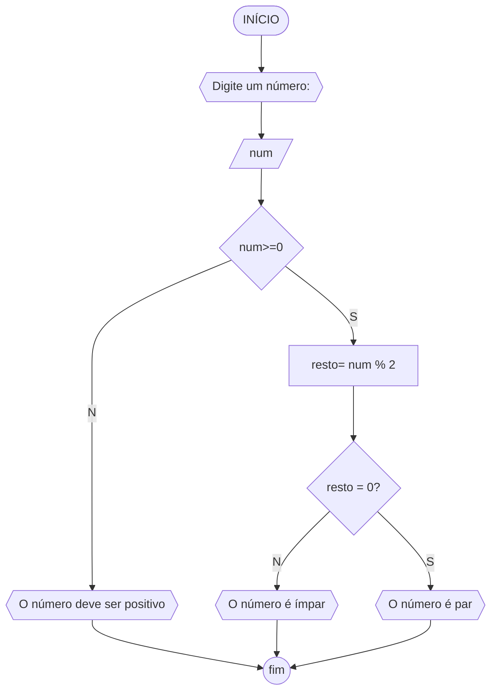

# UNIFOR
**Nome**: Maria Clara Paterno Maia
**Disciplina**: Raciocínio lógico e algoritmo

## Lista de exercícios 01

### Exercício 3
Represente, em fluxograma e pseudocódigo, um algoritmo para deterinar se um número inteiro e positicvo é par ou ímpar.

#### Fluxograma


#### Pseudocódigo
```
ALGORITMO verifica_par_impar
DECLARE num, resto: INTEIRO
INICIO
ESCREVA "Digite um número: "
LEIA num
SE num>=0 ENTAO 
	resto <- num % 2
	SE resto == 0 ENTAO
		ESCREVA "O número é par"
	SENAO 
		ESCREVA "O número é ímpar"
FIM_SE
SENAO
	ESCREVA "O número deve ser positivo"
FIM_SE
FIM
```

#### Teste
| num | resto | num >= 0 | resto == 0 | Saída |
| -- |-- |-- |-- |-- |
|-1 | False |  |  | "O número deve ser positivo" |
| 0 | True | 0 | True | "O número é par"
| 10 | True | 0 | True | "O número é par"
| 11 | True | 1 | False | "O número é ímpar" 
