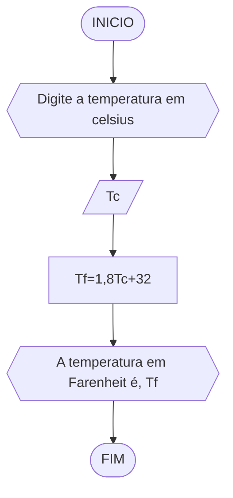

# UNIFOR
**Nome**: Maria Clara Paterno Maia <br>
**Disciplina**: Raciocínio lógico algorítmico

## Exercício exemplo
Represente, em fluxograma e pseudocódigo, um algoritmo para calcular o adicional de salário de funcionário por cargo de uma empresa fictícia. Sabe-se que os funcionários de cargo técnico receberão reajuste de 50%, cargo de gerência, um reajuste de 30% e demais, um reajuste de 10%. 

#### Fluxograma


#### Pseudocódigo
```
1  ALGORITMO calReajuste
2  DECLARE  sal, sal_reaj: real, prof: caractere
3  INICIO
4  LEIA sal, prof
5  ESCOLHA
6   CASO prof == “Técnico”		// caso 1
7     sal_reaj ← 1.5 * sal
8   CASO prof = “Gerente”		// caso 2
9     sal_reaj ← 1.3 * sal
10  SENÃO
11    sal_reaj ← 1.1 * sal
12 FIM_ESCOLHA
13 ESCREVA “Salário Reajustado = “, sal_reaj
14 FIM
```

#### Teste
| sal | prof | prof == “Técnico” | prof = “Gerente” | sal_reaj | Saída |
| -- | -- | -- | -- | -- | -- |
| 1000 | Técnico | V | F | 1500 | “Salário Reajustado = 1500“ |
| 2000 | Gerente | F | V | 2600 | “Salário Reajustado = 2600“ |
| 9000 | Diretor | F | F | 9900 | “Salário Reajustado = 9900“ |

## Lista de exercícios 02

### Exercício 01 (2.5 pontos)
Calcule a média de quatro números inteiros dados.

#### Fluxograma (1.0 ponto)


#### Pseudocódigo (1.0 ponto)

```
Algoritmo Média
DECLARE n1, n2, n3, n4, M: INTEIROS
INICIO
ESCREVA "Digite quatro números inteiros: "
LEIA n1, n2, n3, n4
M <- (n1+n2+n3+n4)/4
ESCREVA "A média dos números é, M"
FIM
```

#### Teste de mesa (0.5 ponto)
| n1 | n2 | n3  | n4 |M | Saída  |
| -- | -- | -- | -- | -- | -- | 
| 1| 2| 3  | 6  |  3 |  A média dos números é 3 |
| 6  | 3 | 2 | 5  | 4   | A média dos números é 4 |
| 4 | 10 | 3 |  7 | 8  |  A média dos números é 8|
| 3 | 6| 27 | 4  |  10 |  A média dos números é 10 | 


### Exercício 02 (2.5 pontos)
Leia uma temperatura dada em Celsius (C) e imprima o equivalente em Fahrenheit (F). (Fórmula de conversão: F = (9/5) * C + 32)

#### Fluxograma (1.0 ponto)



#### Pseudocódigo (1.0 ponto)

```
Algoritmo ConverteCelsiusFarenheit
DECLARE Tc, Tf: INTEIROS 
INICIO
ESCREVA "Digite a temperatura em celsius: "
LEIA Tc 
Tf <- 1,8Tc+32
ESCREVA "A temperatura em Farenheit é, Tf"
FIM
```

#### Teste de mesa (0.5 ponto)
| Tc  |  Tf  |               saída                     |  
| --  |  --  |                --                       |      
| 30  |  86  |    "A temperatura em Farenheit é 86"    |    
| 45  |  113 |   "A temperatura em Farenheit é 113"    |   
| 89  | 192,2 | "A temperatura em Farenheit é 192,2"   | 


### Exercício 03 (2.5 pontos)
Receba dois números reais e um operador e efetue a operação correspondente com os valores recebidos (operandos). 
O algoritmo deve retornar o resultado da operação selecionada simulando todas as operações de uma calculadora simples.

#### Fluxograma (1.0 ponto)


#### Pseudocódigo (1.0 ponto)

```
Algoritmo Calculadora
DECLARE n1, n2, r: reais 
DECLARE operador: string
INICIO
ESCREVA "Digite dois números reais: "
LEIA n1, n2
ESCREVA "Digite um operador +, -, x, /: "
SE operador == + ENTAO
	r <- n1+n2
SE operador == - ENTAO
	r <- n1-n2
SE operador == x ENTAO
	r <- n1*n2
SE operador == / ENTAO
	r <- n1/n2
FIM_SE
ESCREVA "O resultado da operação é, r"
FIM
```

#### Teste de mesa (0.5 ponto)

| n1 | n2 | operador  | r  |Saída |
| -- | -- | -- | -- |  -- |
| 18 | 2 |  + | 20 | "O resultado da operação é 20" |
| 16  | 2 | x |  32  |"O resultado da operação é 32"  |
| 13 | 5 | - | 8  |  "O resultado da operação é 8"|
| 30 | 6 | / | 5 |"O resultado da operação é 5"  |

### Exercício 04 (2.5 pontos)
Elaborar um algoritmo que, dada a idade, classifique nas categorias: infantil A (5 - 7 anos), infantil B (8 -10 anos), juvenil A (11 - 13 anos), juvenil B (14 -17 anos) e adulto (maiores que 18 anos).

#### Fluxograma (1.0 ponto)


#### Pseudocódigo (1.0 ponto)
```
Algoritmo CategoriaIdade
DECLARE I: INTEIRO
INICIO
ESCREVA "Digite a sua idade: "
LEIA I
SE 7>=I>=5 ENTAO
	ESCREVA "Você está na categoria infantil A"
	SE 10>=I>=8 ENTAO
		ESCREVA "Você está na categoria infantil B"
		SE  13>=I>=11 ENTAO
			ESCREVA "Você está na categoria juvenil A"
			SE 17>=I>=14 ENTAO
			ESCREVA "Você está na categoria juvenil B"
				SE I>18 ENTAO
				ESCREVA "Você está na categoria adulto"
FIM_SE
FIM
```

#### Teste de mesa (0.5 ponto)
| I | 7>=I>=5 | 10>=I>=8 | 13>=I>=11 | 17>=I>=14 | I>18 | Saída |
|-- |   --    |    --    |    --     |    --     |  --  |   --  |
| 6 | T |   |   |   |   |  "Você está na categoria infantil A"  |
|10 | F | T |   |   |   | "Você está na categoria infantil B"   |
|12 | F | F | T |   |   |"Você está na categoria juvenil A" |
| 9 | F | T |   |   |   | "Você está na categoria infantil B" |
|17 | F | F | F | T |   | "Você está na categoria juvenil B" |
|18 | F | F | F | F | T | "Você está na categoria adulto" |
