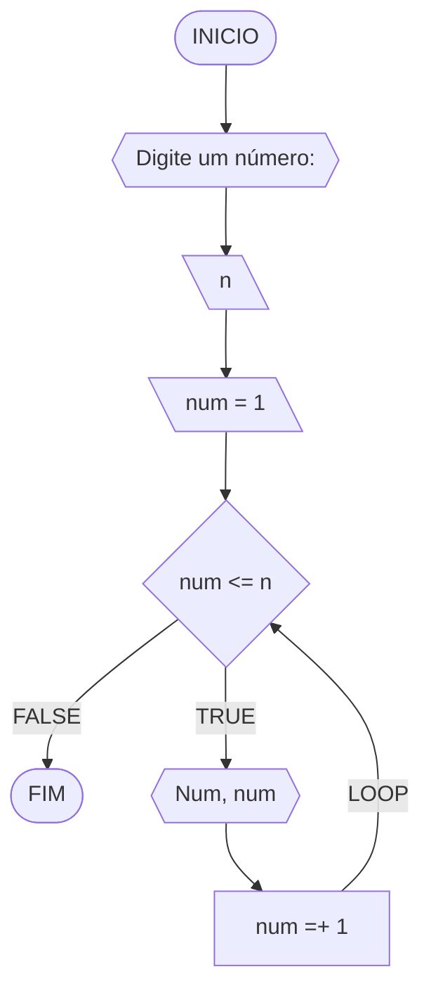
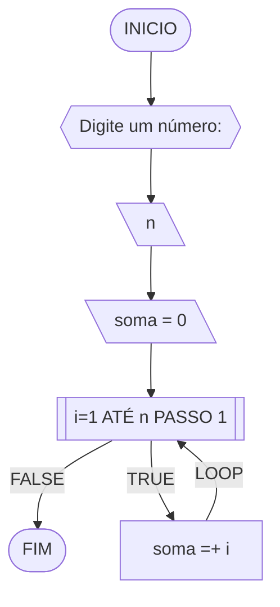
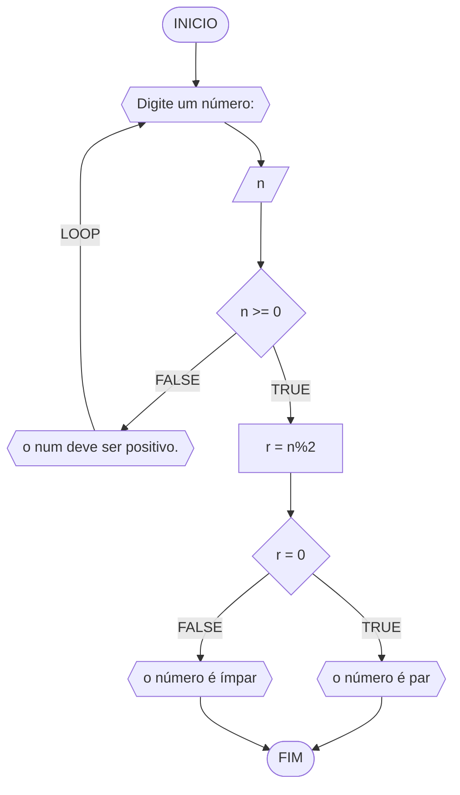
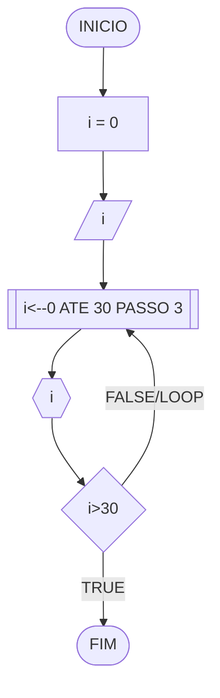
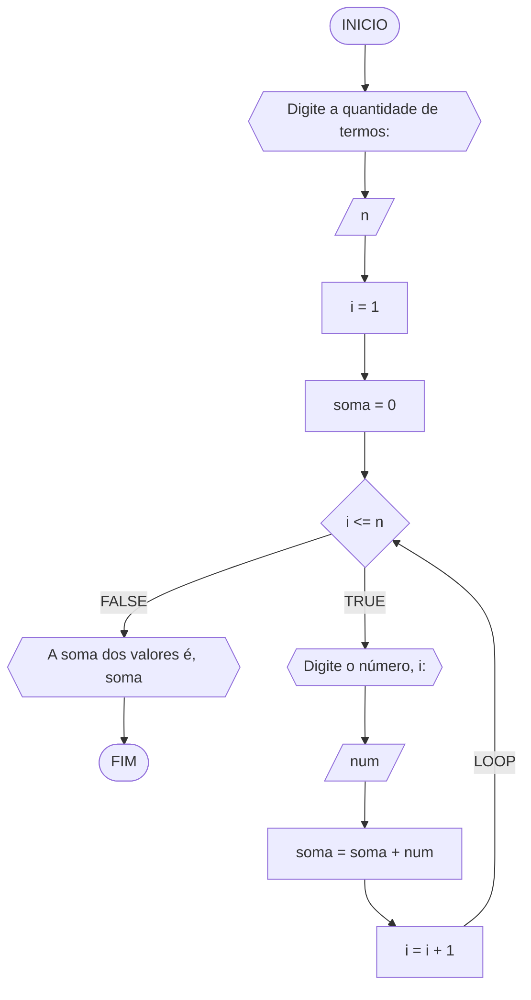
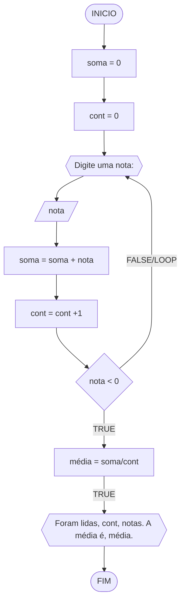

# UNIFOR
**Nome**: Maria Clara Paterno Maia <br>
**Disciplina**: Raciocínio lógico algorítmico

## Exercício exemplo 1
Implemente e teste um programa que imprima os n primeiros números.

#### Fluxograma


#### Pseudocódigo
```
1 ALGORITMO print_n_primeiros
2 DECLARE n, num: INTEIRO
3 INICIO
4 ESCREVA “Digite um número: ”
4 LEIA n			// variável de entrada n
4 num ← 1			// variável num inicializada
5 ENQUANTO num <= n FAÇA	// n iterações
7	ESCREVA “Número ”, num
8	num ← num + 1		// num =+ 1 (incremento)
8 FIM_ENQUANTO
9 FIM
```

#### Teste de mesa
| it | n  | num | num <= n | Saída      | num =+ 1 |
| -- | -- | --  | --       | --         | --       |
| 1  | 10 | 1   | True     | Número 1   | 2        |
| 2  | 10 | 2   | True     | Número 2   | 3        |
| 3  | 10 | 3   | True     | Número 3   | 4        |
| 4  | 10 | 4   | True     | Número 4   | 5        |
| 5  | 10 | 5   | True     | Número 5   | 6        |
| 6  | 10 | 6   | True     | Número 6   | 7        |
| 7  | 10 | 7   | True     | Número 7   | 8        |
| 8  | 10 | 8   | True     | Número 8   | 9        |
| 9  | 10 | 9   | True     | Número 9   | 10       |
| 10 | 10 | 11  | True     | Número 10  | 11       |
| 11 | 10 | 11  | False    |            |          |

## Exercício exemplo 2
Implemente e teste um programa que some os n primeiros números.

#### Fluxograma


#### Pseudocódigo
```
1  ALGORITMO	soma_n_numeros()
2  DECLARE	n, i, soma: INTEIRO
3  INICIO
4  ESCREVA “Digite a quantidade de números: ”
5  LEIA n		// variável de entrada n
7  soma ← 0		// variável soma inicializada
6  PARA i DE 1 ATÉ n PASSO 1 FAÇA
7	soma ← soma + i	// soma =+ i (incremento)
8  FIM_PARA
9  ESCREVA “A soma é igual a ”, soma
10 FIM
```

#### Teste de mesa
| it | n  | soma | i  | soma =+ i |
| -- | -- | --   | -- | --        |
| 1  | 10 | 0    | 1  | 1         |
| 2  | 10 | 1    | 2  | 3         |
| 3  | 10 | 3    | 3  | 6         |
| 4  | 10 | 6    | 4  | 10        |
| 5  | 10 | 10   | 5  | 15        |
| 6  | 10 | 15   | 6  | 21        |
| 7  | 10 | 21   | 7  | 28        |
| 8  | 10 | 28   | 8  | 36        |
| 9  | 10 | 36   | 9  | 45        |
| 10 | 10 | 45   | 10 | 55        | 

## Lista de exercícios 03

### Exercício 01 (2.5 pontos)
Atualize o algoritmo para determinar se um número inteiro e positivo é par ou ímpar, usando uma laço condicional para aceitar apenas números maiores ou iguais a zero. 

#### Fluxograma (1.0 ponto)



#### Pseudocódigo (1.0 ponto)

```
ALGORTIMO verifica_par_impar
DECLARE n, r: INTEIRO
INICIO
ESCREVA "Digite um número: "
LEIA n
ENQUANTO n<0 FAÇA
	ESCREVA "O número deve ser positivo"
FIM_ENQUANTO	
SE n >= 0 ENTAO                  
r <- n % 2                 
	SE r == 0 ENTAO               
	ESCREVA "O número é par"
	SENAO
	ESCREVA "O número é impar"
FIM_SE
FIM		
```

#### Teste de mesa (0.5 ponto)

|  n  |  r  | r == 0 | saída |
| --   |  --  |  --  |  --  |
|  -1   |     |     |  "O número deve ser positivo"  |
|  2   |  0   |   T  |   "O número é par"  |
|  3   |  1   |   F  |  "O número é impar"   |


### Exercício 02 (2.5 pontos)
Faça um algoritmo que exiba na tela uma contagem de 0 até 30, exibindo apenas os múltiplos de 3.

#### Fluxograma (1.0 ponto)



#### Pseudocódigo (1.0 ponto)

```
Algoritmo Contagem_3
DECLARE i: INTEIRO
INICIO
PARA i <-- 0 ATE 30 PASSO 3 FAÇA
	ESCREVA i
FIM_PARA
FIM
```

#### Teste de mesa (0.5 ponto)

|  it  |  i   | saída | i>30 |
| --   |  --  |  --  |  --  |
|  1   |  0   |   0  |   F  |
|  2   |  3   |   3  |   F  |
|  3   |  6   |   6  |   F  |
|  4   |  9   |   9  |   F  |
|  5   |  12  |  12  |   F  |
|  6   |  15  |  15  |   F  |
|  7   |  18  |  18  |   F  |
|  8   |  21  |  21  |   F  |
|  9   |  24  |  24  |   F  |
|  10  |  27  |  27  |   F  |
|  11  |  30  |  30  |   V  |


### Exercício 03 (2.5 pontos)
Dada uma sequência de números inteiros, calcular a sua soma. 
Por exemplo, para a sequência {12, 17, 4, -6, 8, 0}, o seu programa deve escrever o número 35.

#### Fluxograma (1.0 ponto)



#### Pseudocódigo (1.0 ponto)

```
Algoritmo soma_sequencia
DECLARE n, i, soma, num: INTEIROS
INICIO
ESCREVA "Digite a quantidade de termos: "
LEIA n
i <- 1
soma <- 0
ENQUANTO i <= n FAÇA
	ESCREVA "Digite o número, i: "
	LEIA num
	soma <- soma + num
	i <- i + 1
FIM_ENQUANTO
ESCREVA "A soma dos valores é, soma"
FIM
```

#### Teste de mesa (0.5 ponto)
| cont |  soma   | valor | soma + valor  |  
|  --  |    --   |   --  |   --          |
|  1   |  0      |  4    |   4           |
|  2   |    4    |   5   | 9             |  
|  3   |     9   |   10  | 19            |  
|  4   |   19    |   3   | 22            |  
|  5   |   22    |  6    |  28           |  


### Exercício 04 (2.5 pontos)
Escreva um programa que leia a nota de diversos alunos, até que seja digitada uma nota negativa. 
Nesse momento, ele mostra a média aritmética de todas as notas lidas e quantas notas foram lidas. 
Ex. Foram lidas 14 notas. A média aritmética é 6.75!

#### Fluxograma (1.0 ponto)



#### Pseudocódigo (1.0 ponto)

```
Algoritmo MédiaNotas
DECLARE soma, cont, nota, média: INTEIROS
INICIO
soma <- 0
cont <- 0
ESCREVA "Digite uma nota: "
LEIA nota
ENQUANTO nota > 0 FAÇA
	soma <- soma + nota
	cont <- cont + 1
FIM_ENQUANTO
média <- soma/cont
ESCREVA "Foram lidas, cont, notas. A média é, média."
FIM
```

#### Teste de mesa (0.5 ponto)
| cont | soma | nota | soma + nota | cont +1 | média|
|  --  | --   |  --  |   --        |   --    | --   |
|  0   |  0   |   4  |       4     |    1    |      |
|  1   |  4   |   5  |       9     |    2    |      |
|  2   |  9   |  10  |      19     |    3    |      |
|  3   |  19  |   7  |      26     |    4    |      |
|  4   |  26  |   6  |      32     |    5    |      |
|  5   |  32  |   8  |      40     |    6    |      |
|  6   |  40  |   9  |      49     |    7    |      |
|  7   |  49  |  -3  |             |         |  7   |


